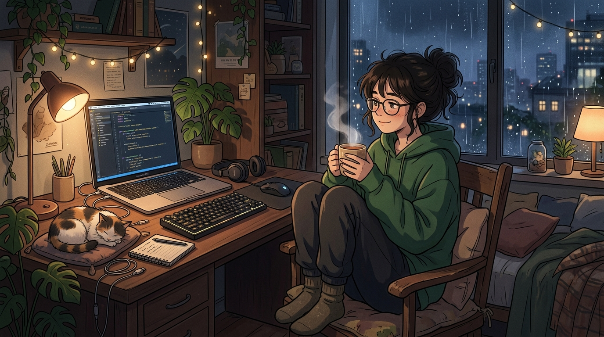

# 📘 Riset Naskah & Transkrip Audiobook: Belajar Laravel Untuk Pemula 🎧😴



Dokumen ini berisi riset materi, petunjuk arah suara (*Audio Direction Tags*), **transkrip naskah micro-chunk (< 400 karakter)**, serta **Prompt Image-to-Video AI (Runway/Kling/Luma/Sora)** untuk setiap bagian scene berdasarkan gambar **Character Reference Sheet Avatar (`cover_main_character.jpg`)** di atas.

---

## 👤 Profil & Panduan Avatar Character Reference Sheet

- **Input Gambar Reference (Upload)**: Upload file [`cover_main_character.jpg`](./cover_main_character.jpg) ke platform AI Video (Runway Gen-2/Gen-3, Kling AI, Luma Dream Machine, Pika, Midjourney `--cref`, dll.).
- **Detail Karakter (Multi-Angle)**:
  - **Model**: *Female web artisan / programmer, dark hair in a cute top bun, round black glasses.*
  - **Outfit**: *Cozy oversized dark green hoodie.*
  - **Props**: *Steaming mug, laptop with blue code editor, mechanical keyboard, sleeping calico cat.*
  - **Keunggulan**: Gambar di atas menyajikan sudut pandang depan, samping, dan belakang (*over-the-shoulder*) sehingga gerakan animasi AI video akan konsisten 100% antar scene.
- **Format Video**: *Silent visual loop (tanpa suara/audio bawaan) agar pas saat di-merge dengan MP3 Audiobook.*

---

## 📋 Rekomendasi Voice Over Pilihan (Knox / Orla / Paz)

- **Pilihan Pria Utama**: **`Knox`** (*Smooth, low pitch*) — Nada rendah & halus.
- **Pilihan Wanita Utama**: **`Orla`** (*Gentle, medium pitch*) — Lembut & tenang.
- **Pilihan Whisper/ASMR**: **`Paz`** (*Breathy, low pitch*) — Efek bisikan pengantar tidur.

---

## 🎙️ Transkrip Naskah & Prompt Image-to-Video AI (13 Bagian)

---

### 🟢 **BAGIAN 1: PEMBUKAAN (PART 1)** *(~380 Karakter)*

```text
[long pause] 
  
PEMBUKAAN: MELEPAS PENAT DAN SELAMAT DATANG  
  
[natural pace] Selamat malam...   
[slow pace] Rebahkan badanmu perlahan di atas kasur yang empuk...   
Lemaskan otot-otot bahumu... [thoughtful] kendorkan jemarimu yang lelah setelah seharian mengetik kode...   
Tarik napas dalam-dalam... [inhale] lalu hembuskan dengan perlahan...
```

🎬 **Prompt Image-to-Video (Upload `cover_main_character.jpg`):**
> *Animate the uploaded character image: slow-motion motion of the girl taking a slow deep breath while holding her steaming mug, rising steam from the cup, subtle rain movement on window glass, gentle parallax camera push-in, cozy lofi atmosphere, silent video, no audio, muted.*

---

### 🟢 **BAGIAN 2: PEMBUKAAN (PART 2)** *(~240 Karakter)*

```text
Malam ini... tidak ada error 500... tidak ada terminal yang memerah...   
Tidak ada tenggat waktu yang mengejar...   
Hanya ada ketenangan... [positive] dan sebuah petualangan lembut di negeri yang indah bernama Laravel...  
  
[medium pause]
```

🎬 **Prompt Image-to-Video (Upload `cover_main_character.jpg`):**
> *Animate the uploaded character image: the girl leans back slightly with a peaceful relaxed smile, eyes blinking gently, soft fairy lights twinkling in background, calm laptop screen glow, subtle camera zoom, silent video, no audio, muted.*

---

### 🟢 **BAGIAN 3: BAB 1 (OASE LARAVEL - PART 1)** *(~300 Karakter)*

```text
BAB 1: MENGENAL SEBUAH OASE BERNAMA LARAVEL  
  
Bayangkan sebuah taman yang hijau dan sejuk...   
Di sinilah Laravel berdiri... Sebuah framework PHP yang dirancang dengan anggun dan elegan untuk para web artisan...
```

🎬 **Prompt Image-to-Video (Upload `cover_main_character.jpg`):**
> *Animate the uploaded character image: zoom-in on the girl's glasses reflecting soft green digital foliage particles floating gracefully, cozy warm desk lamp lighting, slow-motion dreamlike motion, silent video, no audio, muted.*

---

### 🟢 **BAGIAN 4: BAB 1 (OASE LARAVEL - PART 2)** *(~310 Karakter)*

```text
Laravel hadir bukan untuk menyulitkanmu...   
Ia diciptakan untuk mempermudah langkahmu... membungkus kerumitan kode PHP native menjadi sintaks yang bersih... indah... dan menenangkan...  
  
[admiration] Ketika framework lain terasa kaku... Laravel menyambutmu dengan penuh kehangatan...   
Setiap komponennya bekerja seperti simfoni yang harmonis...
```

🎬 **Prompt Image-to-Video (Upload `cover_main_character.jpg`):**
> *Animate the uploaded character image: the girl typing gently on the keyboard, subtle finger movement, calico cat breathing peacefully while sleeping on desk, rain droplets sliding down the night window, warm cozy lighting, silent video, no audio, muted.*

---

### 🟢 **BAGIAN 5: BAB 2 (INSTALASI HENING - PART 1)** *(~350 Karakter)*

```text
BAB 2: INSTALASI YANG HENING DAN DAMAI  
  
Kini... bayangkan jemarimu membuka terminal dengan sangat santai...   
Di layar komputer yang meredup... kita mengetikkan perintah lembut:  
composer create-project laravel/laravel...  
  
Lihatlah baris-baris teks mengalir di layar seperti rintik hujan malam yang menenangkan...
```

🎬 **Prompt Image-to-Video (Upload `cover_main_character.jpg`):**
> *Animate the uploaded character image: focus on the laptop screen showing terminal code scrolling down smoothly, green text glowing gently, avatar watching calmly, rain outside window, silent video, no audio, muted.*

---

### 🟢 **BAGIAN 6: BAB 2 (INSTALASI HENING - PART 2)** *(~330 Karakter)*

```text
Composer mengunduh paket-paket dependensi satu per satu...   
Semuanya berjalan tanpa hambatan... tanpa kepanikan...  
  
Jika menggunakan Windows atau Linux... kita hanya perlu mengaktifkan ekstensi OpenSSL dengan tenang...   
Semua prasyarat terpenuhi... dan fondasi aplikasimu kini telah berdiri dengan kokoh...
```

🎬 **Prompt Image-to-Video (Upload `cover_main_character.jpg`):**
> *Animate the uploaded character image: the girl resting her chin on her hand, nodding very slowly with a calm expression, soft desk lamp light shimmering on her glasses, silent video, no audio, muted.*

---

### 🟢 **BAGIAN 7: BAB 3 (TELAGA DATABASE - PART 1)** *(~380 Karakter)*

```text
BAB 3: PERSIAPAN DATABASE DAN STRUKTUR TABEL  
  
Di tengah keheningan... mari kita membayangkan sebuah telaga jernih...   
Telaga itu adalah database kita... tempat menyimpan data dengan aman dan rapi...  
  
Kita membuat tabel bernama siswa...   
Setiap kolom id, nama, alamat, dan kelas tertata begitu presisi...
```

🎬 **Prompt Image-to-Video (Upload `cover_main_character.jpg`):**
> *Animate the uploaded character image: camera slowly panning towards the window where rain reflects a magical glowing lake under starry sky, avatar turning head gracefully to look outside, silent video, no audio, muted.*

---

### 🟢 **BAGIAN 8: BAB 3 (TELAGA DATABASE - PART 2)** *(~310 Karakter)*

```text
Di dalam file konfigurasi dot-env... kita menyambungkan aplikasi menuju telaga tersebut...  
DB_DATABASE=laravel...   
DB_USERNAME=root...   
Koneksi terjalin dengan sempurna... mengalir tanpa henti...  
  
Kita juga menyapa Bootstrap dan jQuery...   
Menata tampilan dengan grid yang simetris dan warna yang lembut di mata...
```

🎬 **Prompt Image-to-Video (Upload `cover_main_character.jpg`):**
> *Animate the uploaded character image: the girl raising her mug to take a calm slow sip, cat tail twitching softly while sleeping, laptop UI screen glowing softly, silent video, no audio, muted.*

---

### 🟢 **BAGIAN 9: BAB 4 (SIMFONI CRUD - CREATE & READ)** *(~420 Karakter)*

```text
BAB 4: SIMFONI CRUD (CREATE, READ, UPDATE, DELETE)  
  
Siklus kehidupan aplikasi mengalir dalam empat gerakan yang tenang... CRUD...  
  
Pertama... Create...   
Melalui home.blade.php dan Form::open... kita memasukkan data baru...   
Data itu mengalir lembut masuk ke dalam pelukan database...  
  
Kedua... Read...   
Melalui method DB::table('siswa')->get()...   
Data dipanggil kembali dan ditampilkan dengan anggun di dalam tabel HTML yang rapi...
```

🎬 **Prompt Image-to-Video (Upload `cover_main_character.jpg`):**
> *Animate the uploaded character image: gentle side camera movement showing code lines moving smoothly on laptop, avatar smiling subtly, steam rising from mug, cozy ambient glow, silent video, no audio, muted.*

---

### 🟢 **BAGIAN 10: BAB 4 (SIMFONI CRUD - UPDATE & DELETE)** *(~400 Karakter)*

```text
Ketiga... Update...   
Jika ada perubahan dalam hidup... kita dapat memperbaruinya dengan tenang...   
Form edit mengambil data lama... menggantinya dengan yang baru... tanpa sedikit pun merusak harmoni yang ada...  
  
Dan keempat... Delete...   
Hal-hal yang tak lagi dibutuhkan... kita lepas dengan ikhlas melalui Route::get hapus...   
Menjadikan ruang kembali bersih dan lapang...
```

🎬 **Prompt Image-to-Video (Upload `cover_main_character.jpg`):**
> *Animate the uploaded character image: the girl clicking her mouse softly, subtle light particles dissolving gently on screen, serene facial expression, rain drops falling outside, silent video, no audio, muted.*

---

### 🟢 **BAGIAN 11: BAB 5 (AUTENTIKASI & LOGIN)** *(~430 Karakter)*

```text
BAB 5: AUTENTIKASI DAN MENJAGA PINTU HAK AKSES  
  
Di malam yang semakin larut... kita membangun benteng perlindungan...   
Sistem Login dan Register...  
  
Password disandikan dengan algoritma bcrypt yang aman... seperti pesan rahasia yang terkunci dalam peti kayu tua...  
Saat pengguna mengetikkan nama dan katakunci... Auth::attempt memeriksa pintu gerbang...  
  
Jika ia seorang Admin... ia disambut dengan halaman utama untuk mengelola ruang...   
Jika ia seorang User biasa... ia disambut dengan kehangatan ucapan selamat datang...  
Setiap orang mendapatkan tempatnya masing-masing... aman dan terlindungi...
```

🎬 **Prompt Image-to-Video (Upload `cover_main_character.jpg`):**
> *Animate the uploaded character image: golden lock glow reflection on laptop screen, avatar adjusting her hoodie comfortably, warm lamp light flickering gently, cozy night mood, silent video, no audio, muted.*

---

### 🟢 **BAGIAN 12: BAB 6 (VALIDASI BIJAKSANA)** *(~360 Karakter)*

```text
BAB 6: VALIDASI YANG BIJAKSANA  
  
Laravel tidak pernah membiarkan kekacauan masuk...   
Melalui Form Request Validation... aplikasi menjaga dirinya sendiri...  
  
Jika ada kolom yang terlupa diisi... validasi menyampaikan pesannya secara santun...   
"Harus mengisi nama... Harus mengisi password..."  
Tanpa amarah... tanpa membuat sistem terhenti...   
Semuanya terkendali dengan sangat bijaksana...
```

🎬 **Prompt Image-to-Video (Upload `cover_main_character.jpg`):**
> *Animate the uploaded character image: avatar nodding approvingly with a gentle smile, green checkmark glow reflecting on screen, sleeping cat snoring softly, silent video, no audio, muted.*

---

### 🟢 **BAGIAN 13: BAB 7 (PENUTUP & SELAMAT TIDUR)** *(~380 Karakter)*

```text
BAB 7: PENUTUP DAN SELAMAT TIDUR  
  
Kini... semua bab telah tuntas dipelajari...   
Aplikasi Laravel-mu sudah siap... berjalan dengan anggun dan sempurna...  
  
Layar komputermu kini perlahan meredup...   
Suara ketukan keyboard telah berganti menjadi helaan napasmu yang teratur...   
[sigh] Tidak ada lagi hal yang perlu dikhawatirkan malam ini...  
  
Biarkan pikiranmu melayang bebas... menuju mimpi yang indah dan damai...   
Terima kasih telah belajar...   
[whisper] Selamat tidur, web artisan... Besok hari yang baru telah menunggumu...
```

🎬 **Prompt Image-to-Video (Upload `cover_main_character.jpg`):**
> *Animate the uploaded character image: avatar closing laptop lid gently, desk lamp dimming down to darkness, girl resting her head on desk next to sleeping cat, peaceful sleep animation, slow fade to black, silent video, no audio, muted.*
